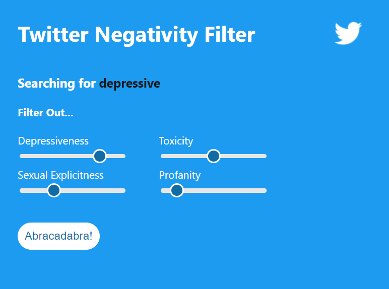
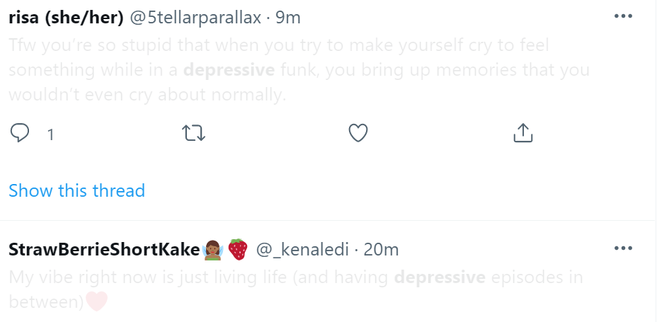
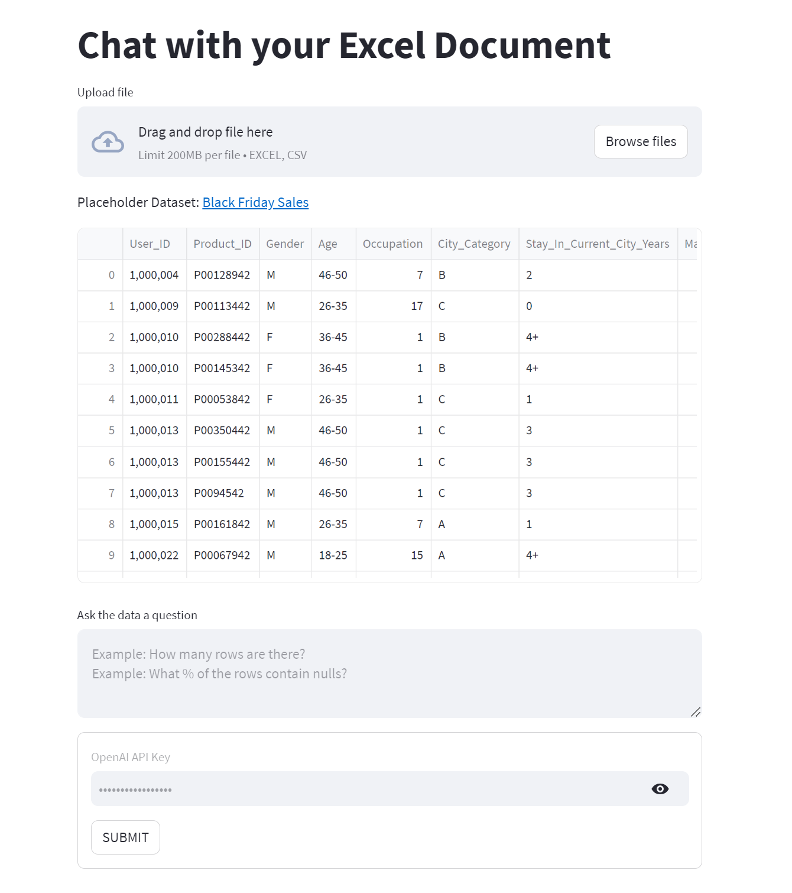

<!-- ---
title: "Portfolio"
toc: true
toc_label: "Table of Contents"
toc_icon: "bookmark"
--- -->
*Updated: 8/7/2023

# Portfolio

---

## Education
- M.S. Information, University of Michigan (_May 2022_)
- B.A. FTVM, University of Michigan (_May 2020_)

---

## Certifications
- Google Professional Data Engineer (exp. _June 2025_)
- Google Associate Cloud Engineer (exp. _March 2025_)
- SnowPro Core Certification (exp. _July 2025_)

---
## Work Experience

**Data Scientist @ KPMG, Digital Lighthouse (_July 2022 - Present_)**
- Designed a Google Cloud pipeline for summarizing earnings call transcripts using LangChain’s framework for chaining a VertexAI model with a VectorStore to provide contextual querying based on predefined prompts for a large banking client
- Performed attrition modeling for a leading global life sciences company, analyzing attrition for vulnerable populations with survival curves, time series analyses, and statistical inference, delivering a set of Power BI dashboards for monitoring risk
- Repaired an outdated ML pipeline predict box office results for a large streaming service using social media sentiment with 70%+ accuracy by updating deprecated API features, streamlining comment scraping, and improving regularization methods
- Presented on bootstrapping generative AI approaches for over 230 colleagues, providing tutorials on creating Streamlit.io [demos](https://github.com/ccmilne/GenAI_Boilerplate_Streamlit) with OpenAI, summarization tasks, and prompt engineering strategies for KPMG’s internal ChatGPT API with Jupyter

---
## Natural Language Processing (NLP) Projects

### Twitter Plug-In for Reducing Harmful Content

Built a Chrome extension capable of filtering a Twitter feed based on negative content (e.g. depressiveness) using an XgBoost model and packing into a RESTful API deployed on Heroku (Github, Medium)

<!-- 

 -->

---
### Comparing Pre-trained and Fine-tuned Transformers Models on Patent Data

Compared performance of LLM models (BART, Pegasus, T5) before and after fine-tuning on patent data to measure generalizability of popular transformer models on scientific language and performance trade offs for size differences

---
### Excel Document Analyzer with LangChain and VertexAI

LangChain and LLM-backed application for providing Q&A capabilities on an Excel document

---
## Information Retrieval Projects

---
## Data Science Projects