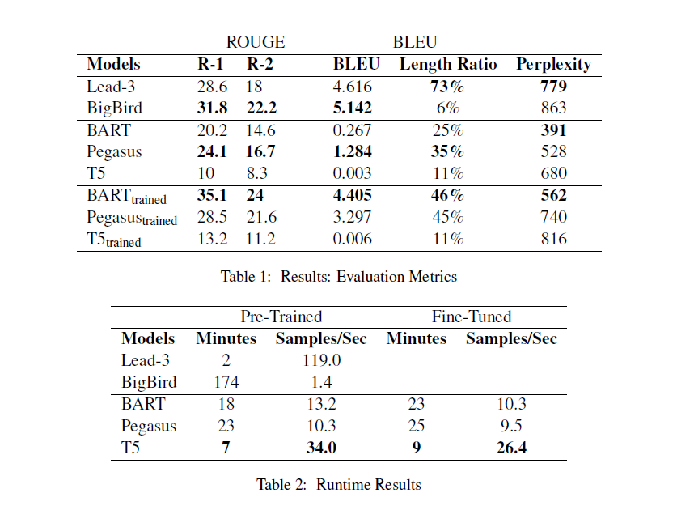
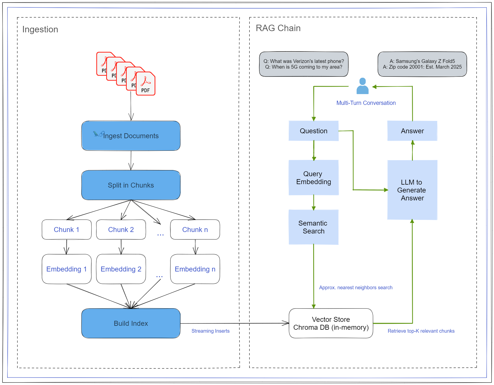

# Portfolio
*Updated: 9/6/2023*

---

## Education
- M.S. Information, University of Michigan (_May 2022_)
- B.A. FTVM, University of Michigan (_May 2020_)

---

## Certifications
- Google Professional Data Engineer (exp. _June 2025_)
- Google Associate Cloud Engineer (exp. _March 2025_)
- SnowPro Core Certification (exp. _July 2025_)

---
## Work Experience

**Data Scientist @ KPMG, Digital Lighthouse (_July 2022 - Present_)**
- Designed a Google Cloud pipeline for summarizing earnings call transcripts using LangChain’s framework for chaining a VertexAI model with a VectorStore to provide contextual querying based on predefined prompts for a large banking client
- Performed attrition modeling for a leading global life sciences company, analyzing attrition for vulnerable populations with survival curves, time series analyses, and statistical inference, delivering a set of Power BI dashboards for monitoring risk
- Repaired an outdated ML pipeline predict box office results for a large streaming service using social media sentiment with 70%+ accuracy by updating deprecated API features, streamlining comment scraping, and improving regularization methods
- Presented on bootstrapping generative AI approaches for over 230 colleagues, providing tutorials on creating Streamlit.io [demos](https://github.com/ccmilne/GenAI_Boilerplate_Streamlit) with OpenAI, summarization tasks, and prompt engineering strategies for KPMG’s internal ChatGPT API with Jupyter

---
## Natural Language Processing (NLP) Projects

### Twitter Plug-In for Reducing Harmful Content

[](https://github.com/andy-techen/better-social-media)
[](https://medium.com/@ccmilne/filtering-twitter-reducing-toxic-depressive-profane-and-sexually-explicit-tweets-through-a6e2220e1760)

Built a Chrome extension capable of filtering a Twitter feed based on negative content (e.g. depressiveness) using an XgBoost model and packing into a RESTful API deployed on Heroku (Github, Medium)

<center></center>
<!-- <center></center> -->

---
### Comparing Pre-trained and Fine-tuned Transformers Models on Patent Data

[](https://github.com/ccmilne/huggingface-fine-tuning)

Compared performance of LLM models (BART, Pegasus, T5) before and after fine-tuning on patent data to measure generalizability of popular transformer models on scientific language and performance trade offs for size differences

<center></center>

---
### Verizon Support and Sales Chatbot Service

[](https://github.com/ccmilne/support-agent-with-langchain)

Python implementation of a support agent capable of discerning a customer/user's motivation and responding with the appropriate personality (tech support vs. sales) to serve their needs.

The project uses LangChain's framework for chaining an augmented retrieval function to a chat LLM to provide document Q&A capabilities. The Agent uses the same LLM and a set of tools with predefined use-cases and retrieval mechanisms to interpret the user input and respond with the appropriate tool. The data used in this repo is a collection of Verizon FAQ materials scraped from their blog.

This is a rudimentary approach approximating a large-scale chatbot service with billing that scales with customer demand and intelligent Q&A capabilities on a personalized dataset.

<center></center>

---
### Excel Document Analyzer with LangChain and VertexAI

[](https://github.com/ccmilne/ExcelDocumentAnalyzer)

LangChain and LLM-backed application for providing Q&A capabilities on an Excel document

<center></center>

---
## Information Retrieval Projects

---

### SI650-IR

[](https://github.com/ccmilne/SI650-IR)

My complete implementation of assignments in _SI-650: Information Retrieval_ at the University of Michigan (Spring, 2022)

Topics include

- [Probabilistic models of retrieval and simple text analysis](https://github.com/ccmilne/SI650-IR/tree/main/assignment1)
- [Building a ranking function and simple search engine](https://github.com/ccmilne/SI650-IR/tree/main/assignment2)
- [Training a deep learning retrieval system (PyTerrier) with GPUs](https://github.com/ccmilne/SI650-IR/tree/main/assignment3)

---
## Data Science Projects

---

### Machine Learning References

[](https://github.com/ccmilne/ml-approaches)

Collection of ML use-cases, implementations, and cleaned datasets for reference. Scripts are sourced from personal projects and coursework.

```bash
|--PyTorch
|   |-- Classifying the Political Framing of Campaign Emails (Logistic Regression)
|   |-- Train a Word2Vec model on Wikipedia Biographies with debiasing (Tensorboard)
|
|--Keras
|   |-- Computer Vision with CNN
|
|--HuggingFace (Transformers)
|   |-- Predicting Helpful Stack Overflow Answers and Data Annotation/Measuring Annotation Quality
|   |-- Pattern-Based Learning (Exploitation Training) for Toxic Language
|
|--Scikit-Learn
|
|--Coursework Examples
|   |--SI630 - Natural Language Processing
|   |   |-- Classifying the Political Framing of Campaign Emails (Logistic Regression)
|   |   |-- Train a Word2Vec model on Wikipedia Biographies with debiasing (Tensorboard)
|   |   |-- Predicting Helpful Stack Overflow Answers and Data Annotation/Measuring Annotation Quality (HuggingFace)
|   |   |-- Pattern-Based Learning (Exploitation Training) for Toxic Language
|   |
|   |--SI670 - Applied Machine Learning
|   |   |--TBD
|   |
|   |--SI671 - Data Mining
|   |   |-- Mining and Evaluating Frequent Itemsets on Twitter Emojis
|   |   |-- Time Series analysis of COVID-19 trends for G7 Nations
|   |   |-- Social Network Analysis for Amazon Product Reviews
```

---
## Tech Stack

<p align='center'>
  
  
  
  
  
  
    
  
  
  
  
  
  
  
  
  
  
    
</p>